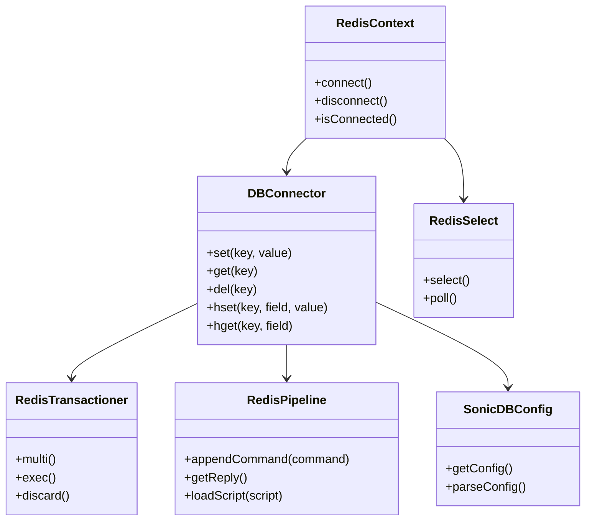
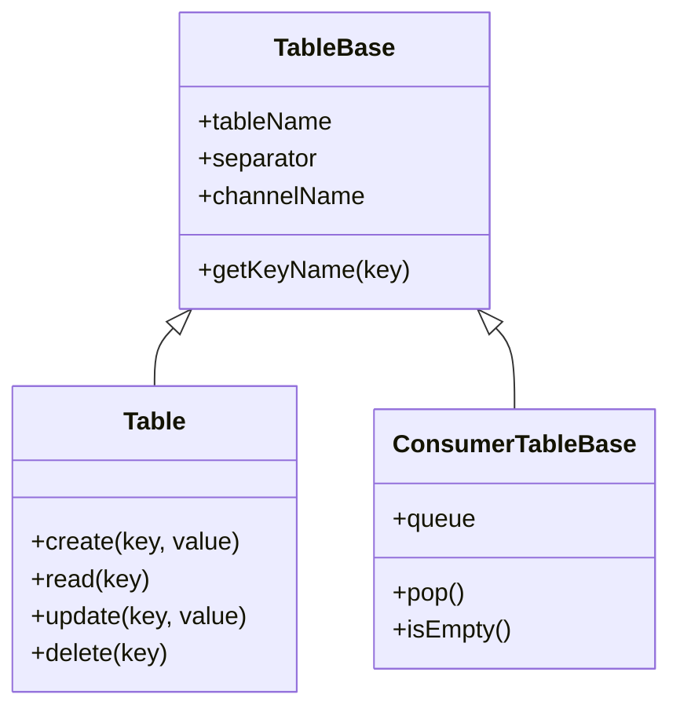

# Redis Wrappers

## Redis 数据库操作层

第一层，也是最低层，是 Redis 数据库操作层。它封装了各种基本命令，如数据库连接、命令执行、事件通知回调接口等。

### 核心类图



### 主要类说明

#### RedisContext
- 封装和维护与 Redis 的连接
- 在销毁时关闭连接
- 提供连接状态管理

#### DBConnector
- 封装所有底层 Redis 命令
- 支持 `SET`、`GET`、`DEL` 等基本操作
- 提供统一的数据库访问接口

#### RedisTransactioner
- 封装 Redis 事务操作
- 支持 `MULTI`、`EXEC` 等事务命令
- 确保多个命令的原子性执行

#### RedisPipeline
- 封装 hiredis redisAppendFormattedCommand API
- 提供异步执行 Redis 命令的接口
- 支持 Lua 脚本的加载和执行

#### RedisSelect
- 实现 Selectable 接口
- 支持基于 epoll 的事件通知机制
- 用于触发 epoll 回调

#### SonicDBConfig
- 静态类，实现 SONiC DB 配置文件的读取和解析
- 为其他数据库操作类提供配置信息

## 表抽象层

在 Redis 数据库操作层之上，是 SONiC 使用 Redis 中的键建立的表抽象层。

### 表结构设计

每个 Redis 键的格式为：`<table-name><separator><key-name>`

### 主要类图



### 主要类说明

#### TableBase
- 所有表的基类
- 封装表的基本信息：表名、Redis 键包装、通信通道名等

#### Table
- 封装表的 CRUD 操作
- 包含表名和分隔符，用于构造最终的键

#### ConsumerTableBase
- 各种 SubscriptionTable 的基类
- 封装简单的队列和 pop 操作
- 专为消费者设计

## 使用示例

### 基本数据库操作

```python
# 创建数据库连接
db = DBConnector(0, "localhost", 6379, 0)

# 设置键值
db.set("test_key", "test_value")

# 获取值
value = db.get("test_key")

# 删除键
db.delete("test_key")
```

### 事务操作

```python
# 创建事务
transaction = RedisTransactioner(db)

# 开始事务
transaction.multi()

# 添加命令
transaction.set("key1", "value1")
transaction.set("key2", "value2")

# 执行事务
transaction.exec()
```

### 表操作

```python
# 创建表
table = Table(db, "test_table", "|")

# 插入数据
table.set("key1", {"field1": "value1", "field2": "value2"})

# 读取数据
data = table.get("key1")

# 更新数据
table.set("key1", {"field1": "new_value1", "field2": "value2"})

# 删除数据
table.del_("key1")
```

## 参考资料

1. [SONiC 架构文档](https://github.com/sonic-net/SONiC/wiki)
2. [sonic-swss 仓库](https://github.com/sonic-net/sonic-swss)
3. [sonic-swss-common 仓库](https://github.com/sonic-net/sonic-swss-common)

---

*本文档基于 SONiC 开源项目，如有问题请提交 Issue 或 Pull Request。*
